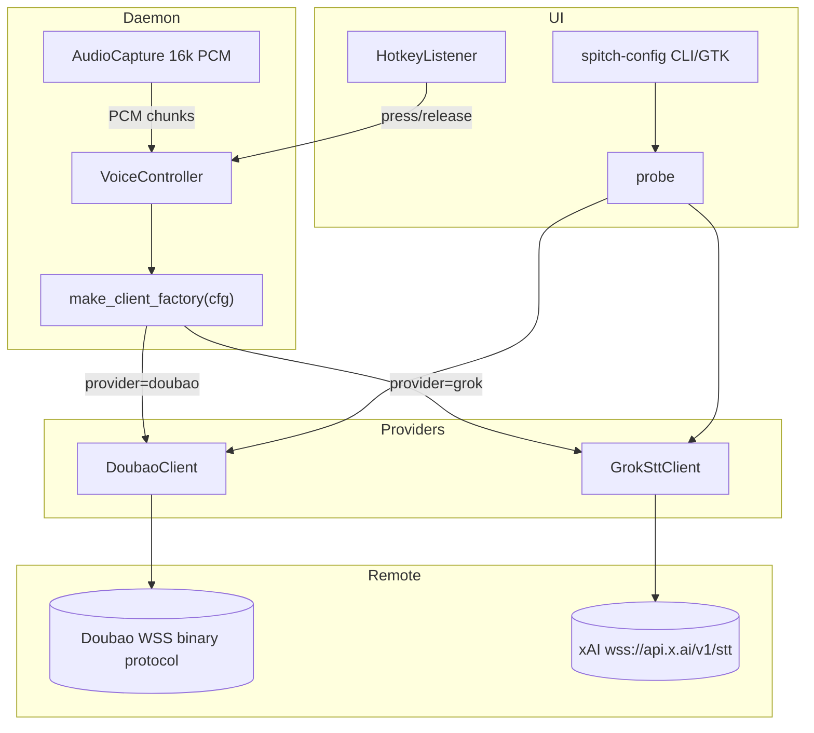
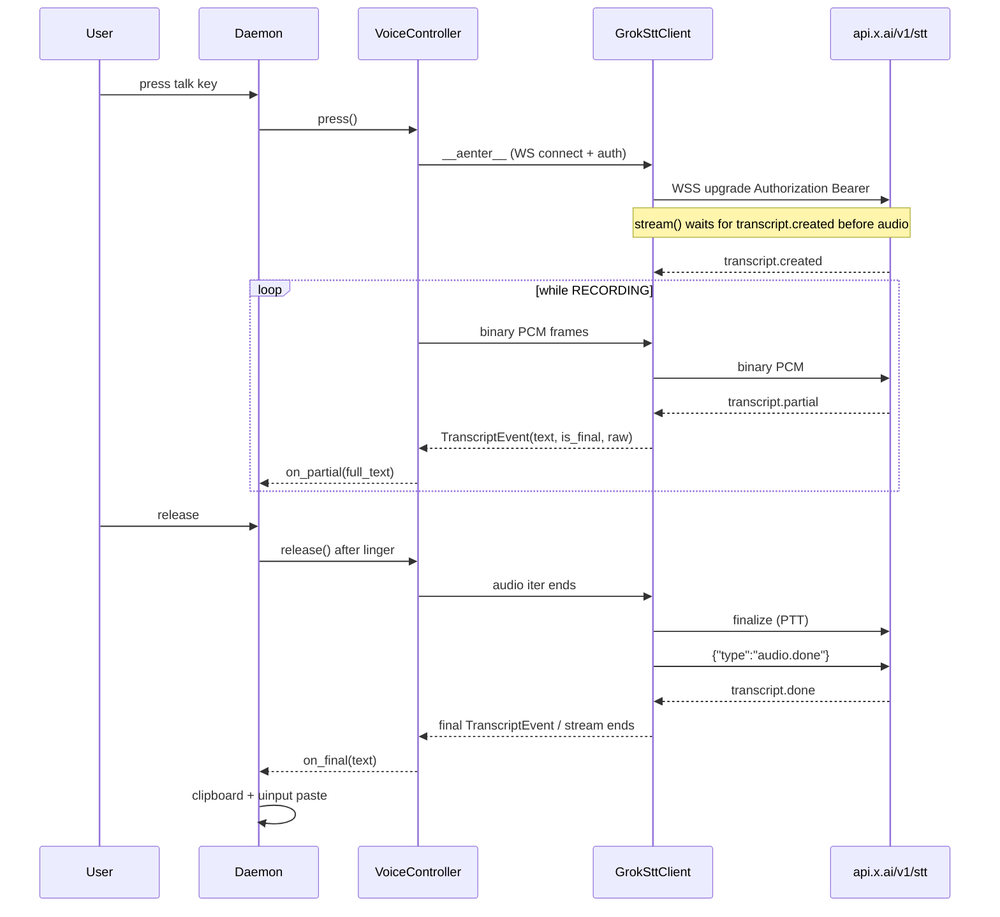

# Add Grok Streaming STT Provider Support to Spitch

| Field | Value |
|-------|-------|
| **Author** | Spitch contributors |
| **Date** | 2026-07-17 |
| **Status** | Approved for implementation (rev 7) |
| **Workspace** | `/home/fruit/dev/system-config/Spitch` |
| **Related** | `src/spitch/voice/doubao.py`, `src/spitch/voice/controller.py`, `src/spitch/config.py`, `src/spitch/daemon.py` |

---

## Overview

Spitch is a Linux desktop global-hotkey Chinese voice input tool. Today it hardcodes **Doubao (Volcano Engine BigModel realtime ASR)** end-to-end: config completeness, credential fingerprinting, the daemon client factory, network warmup, probe, and both CLI/GTK config UIs.

This design adds a second ASR backend — **xAI Grok Streaming Speech-to-Text** at `wss://api.x.ai/v1/stt` — behind the existing multi-provider config key (`provider`) and the already provider-agnostic `StreamingClient` protocol / `VoiceController`. Existing Doubao users keep working with **default `provider: "doubao"`**; users who set `provider: "grok"` and a Grok API key get the same push-to-talk → partials → final inject path.

**Critical product mapping:** Spitch is **dictation (speech → text)**, not a conversational voice agent. We deliberately use **Streaming STT**, not the Grok Voice Agent Realtime API.

**Product language gate:** Spitch’s primary product identity is Chinese voice input. Grok STT’s public language table does **not** list `zh`. Shipping `provider=grok` as a first-class option must **not** claim 中文 support until a defined Mandarin live checklist passes. Until then, Grok is documented as an optional backend with **language support unvalidated for Mandarin**; Doubao remains the default and the recommended Chinese path.

**Rev 4 (external review):** Hardened cancel reliability (controller session-task cancel), websockets 12–15 header compatibility, position-based segment dedup, legacy verification stamp scoping, sender/receiver race, strict probe (`transcript.done` only), and `wss://` endpoint enforcement.

**Rev 5:** Fixed post-EOS receive race (remove completed sender from wait set); cancel-before-task-publish (C0); punctuation-aware EN join; nested config Mapping guards; HTTP status–aware probe classification; `close_timeout` + transport abort on close.

**Rev 6:** Live-stream **no** client terminal timeout (controller owns finalize budget); probe keeps a strict done-wait; `_finalize_deadlines` uses `_section`; cancel schedule catches `RuntimeError`; docs table fixtures aligned.

**Rev 7:** Finite timeout validation (`math.isfinite` + caps); clarify warmup vs probe vs live timeout ownership; **unconditional** single-owner `on_final` on controller exception path.

---

## Background & Motivation

### Current state

| Layer | File | Doubao coupling |
|-------|------|-----------------|
| Config schema / gates | `src/spitch/config.py` | `DEFAULT_CONFIG["provider"] = "doubao"`; `is_complete()` **requires** `provider == "doubao"`; `credentials_signature()` fingerprints only Doubao fields |
| Protocol + client | `src/spitch/voice/doubao.py` | Binary frame codec + `DoubaoClient` implementing connect / probe / stream |
| Controller | `src/spitch/voice/controller.py` | `StreamingClient` Protocol is generic, but `_consume()` accumulation is **Doubao utterance-shaped** (`result.utterances[].definite`) |
| Daemon wiring | `src/spitch/daemon.py` | `_build_voice()` and `_network_warmup_loop()` hardcode `DoubaoClient` / `DoubaoCredentials` |
| Config UI | `src/spitch/ui/config_dialog.py` | Forces `provider = "doubao"`; Doubao-only fields |
| Probe | `src/spitch/ui/probe.py` | Doubao-only |
| Package exports | `src/spitch/voice/__init__.py` | Exports Doubao symbols; `TranscriptEvent` lives in `doubao.py` |
| Tests | `tests/test_doubao_*.py`, `tests/mock_doubao_server.py` | Doubao codec + FakeWS + mock server |

### Known operability gap (pre-existing, fix with Grok wiring)

`SpitchDaemon` reads `inject.final_wait_seconds` into `self._finalize_timeout` (default **30.0** in `DEFAULT_CONFIG`, fallback 5.0 if missing) and uses it only as `queue.get(timeout=…)` in `_finalize_and_inject`. It **never** passes that value into `VoiceController(finalize_timeout=…)`, so the controller keeps its constructor default of **2.0s** for the post-release stream race. After release, the controller may commit the last partial / end the consumer at ~2s while the inject thread still waits up to 30s for `on_final`. README still says “最长 5 秒”. This design **fixes the wiring** when touching `_build_voice` (applies to both providers), with a **linger-safe inequality**: inject wait must be longer than controller wait + `release_linger_ms` + slack so `on_final` cannot fire after inject timed out (see KD-12).

### Pain points

1. **Single vendor lock-in** — users without Volcano Engine grants cannot use Spitch.
2. **Config already has `provider` but rejects non-doubao** — the multi-provider extension point exists in schema but not in logic.
3. **Daemon / UI hardcode Doubao** despite the controller already accepting any `client_factory`.
4. **Dual finalize timers misaligned** — controller 2s vs inject wait 30s (see above).

### Why Grok STT now

xAI ships a dedicated streaming STT WebSocket that matches Spitch’s audio path (16 kHz mono PCM, ~100 ms chunks) and PTT lifecycle (`finalize` + `audio.done` on release). Pricing is transparent (~$0.20/hour streaming). An API key for local validation is available at workspace file `grok-voice-api.key` (**must never be committed**; must be gitignored in the first code PR).

---

## Goals & Non-Goals

### Goals

1. Support `provider: "doubao" | "grok"` with independent credential sections.
2. Implement `GrokSttClient` conforming to `StreamingClient` (`__aenter__` / `__aexit__` / `stream(audio_iter) → AsyncIterator[.text/.is_final]`).
3. Wire daemon factory + network warmup for both providers **in the same change set that makes `is_complete` true for grok** (no intermediate “complete but unwired” state).
4. Extend config completeness / verification fingerprint for Grok.
5. Extend probe + **CLI** config (required) and GTK (same PR if small, else immediate follow-up) to select provider and enter Grok fields.
6. Keep Doubao path byte-compatible and default for existing installs.
7. Unit/integration tests with a mock Grok STT WebSocket (no live key in fixtures; tests never open `grok-voice-api.key`).
8. Document API key handling: config only; optional local-dev seed path mention only.
9. Fix controller/inject finalize waits for all providers with a **linger-safe inequality** (not identical raw timeouts — see KD-12).
10. **Release gate:** no README / UI claim of 中文 for Grok until Mandarin live checklist passes (see Rollout).
11. **Cancel reliability:** controller-level task cancellation during connect and blocked recv, plus bounded WS close (KD-15).
12. **websockets 12–15 header compatibility** for Grok and Doubao (KD-16).
13. **Verification stamp hardening** so unsigned legacy stamps cannot authorize Grok (KD-18).

### Non-Goals

1. **Grok Voice Agent Realtime** (`wss://api.x.ai/v1/realtime?model=grok-voice-latest`) — speech-to-speech agent, wrong product shape.
2. REST batch STT (`POST /v1/stt` file upload) — not for live PTT.
3. TTS, diarization-first UX, multichannel call-center mode.
4. Provider auto-failover / multi-provider simultaneous streaming.
5. Changing inject, hotkey, tray, salmon bus, or history subsystems (except messages that say “Doubao” generically).
6. Shipping the real API key, env-var-only secrets management productization, or cloud key vaults.
7. Smart Turn / advanced endpointing tuning as a v1 requirement (documented as Alt F / v2).

---

## Key Decisions

| # | Decision | Rationale |
|---|----------|-----------|
| **KD-1** | Use **Streaming STT** `wss://api.x.ai/v1/stt`, **not** Voice Agent Realtime | Spitch is hold-to-talk dictation. Voice Agent is bidirectional S2S — higher cost/complexity; wrong product shape. |
| **KD-2** | Config provider string is **`"grok"`** (section key `"grok"`) | Matches user language; endpoint still `api.x.ai`. No `"xai"` alias in v1. |
| **KD-3** | New module `src/spitch/voice/grok_stt.py` parallel to `doubao.py` | Self-contained client + credentials + probe; avoids bloating `doubao.py`. |
| **KD-4** | Extract shared `TranscriptEvent` to `src/spitch/voice/types.py` | Shared by both clients and tests; re-export from `doubao` / package for back-compat. |
| **KD-5** | Controller stays Doubao-aware for `utterances[]`; Grok uses **`evt.text` fallback** | Hard invariant: Grok **never** puts `raw["result"]["utterances"]` (or any Doubao-shaped utterances) in events. Contract-tested. Controller needs only a multi-provider comment in v1. |
| **KD-6** | Grok client owns accumulation via a **deterministic provisional state machine** (below) | **Monotone confirmed prefix** (confirmed segments never shrink); `current` hypothesis may rewrite/shorten. Session ends only on stream end / `transcript.done`, not first `speech_final`. |
| **KD-7** | EOS: on audio iter end → **`finalize` then `audio.done`** (default on) | xAI PTT guidance recommends finalize-on-release; then `audio.done` flushes session and closes. Casing live-validated once; document chosen casing in module docstring. |
| **KD-8** | Defaults: `interim_results=true`, `sample_rate` from audio config (16000), `encoding=pcm`, `language=""` | Empty language avoids unsupported codes until Mandarin validation. |
| **KD-9** | Warmup for Grok calls **`warmup()`** that waits for `transcript.created` (not connect-only) | Grok ASR backend readiness requires `transcript.created` before audio; connect-only is insufficient. Interval remains 240s. |
| **KD-10** | Never embed API key; **`.gitignore` lands in PR 1** (`grok-voice-api.key`, `*.key`) | Key file exists untracked today; any `git add .` before ignore is a leak. Tests never open that path. |
| **KD-11** | **`is_complete` for grok lands only with a daemon that can construct `GrokSttClient`** | Avoid intermediate state where complete+verified grok configs start a Doubao-hardcoded daemon. |
| **KD-12** | Wire long controller finalize wait, but keep **inject queue wait strictly longer than controller wait + release linger + slack**. All deadline inputs **must be finite** (`math.isfinite`) with min/max clamps. | Inject thread starts at key-up; controller `FINALIZING` starts only after `release_linger_ms`. `nan`/`inf` break `max()` and queue timeouts. |
| **KD-15** | **Controller must actively cancel the session task** (including hang during `__aenter__` / blocked `recv`), publish/clear the task under a lock, and **immediately cancel a newly published task if `_cancel` is already set**. Client closes WS with `close_timeout` + transport-abort fallback. | Today `cancel()` only sets a flag + stops audio. Cancel before the worker publishes its loop/task can be lost → hung connect. See Cancel reliability. |
| **KD-13** | Grok `credentials_signature` = `(provider, api_key, endpoint)` only | Language/options are non-auth; editing them must not invalidate verification. |
| **KD-14** | Mandarin support is a **hard docs/marketing release gate**, not assumed | Doubao remains default forever unless Mandarin is proven for Grok. |
| **KD-16** | Shared **`ws_connect_headers` compatibility helper** for `websockets>=12,<16` (`extra_headers` vs `additional_headers`) | Top-level `connect(..., additional_headers=)` is wrong on 12–13; Doubao has the same latent bug. Fix once, use in Grok + Doubao. |
| **KD-17** | Dedup confirmed utterances by **server position** (`start` / `duration`), never by text equality alone | Text-only end-dedup drops legitimate consecutive identical dictation (e.g. “yes” … “yes”). |
| **KD-18** | Legacy unsigned `verified_at` (no `verified_signature`) is **Doubao-only**; Grok always requires a matching signature | Otherwise an old Doubao stamp can authorize unprobed Grok credentials after a manual provider switch. |
| **KD-19** | Grok stream **races receiver against sender**; after successful EOS **remove sender from the wait set**; process both when both finish in one wait. **Live stream has no client terminal timeout** — silent post-EOS is owned by `VoiceController.finalize_timeout`. **Probe** keeps a strict done-wait timeout. | Client 15s timeout would preempt controller 30s budget, raise into dual `on_final` + ERROR. |
| **KD-20** | Probe success requires **`transcript.done`**; classify handshake failures by **HTTP status** (401/400/429/5xx), not all `InvalidHandshake` as bad credentials | Close-without-done fails verification; broad exception classes mislead operators. |
| **KD-21** | Reject non-`wss://` Grok endpoints (optional localhost `ws://` escape hatch only) | Bearer token must not ride cleartext configurable endpoints. |
| **KD-22** | Nested config sections (`doubao`/`grok`/`audio`/`inject`) must be **Mappings** before `.get()`; else incomplete / safe defaults | Malformed `"grok": "bad"` must not crash gates or factory. |
| **KD-23** | EN segment join is **punctuation-aware** (space after sentence/clause punctuation when next segment starts with Latin) | Alnum-only rule glues `"Hello."+"World"` → `"Hello.World"`. |

---

## Proposed Design

### High-level architecture



### Session sequence (Grok STT)



### Module layout

```
src/spitch/voice/
  types.py          # NEW: TranscriptEvent (shared)
  factory.py       # NEW: make_client_factory(cfg) / creds helpers (unit-tested)
  grok_stt.py       # NEW: GrokSttCredentials, GrokSttClient, helpers
  doubao.py         # KEEP: re-export TranscriptEvent for compat
  controller.py     # MINOR: multi-provider comment; no logic change required for Grok
  audio.py          # unchanged
  __init__.py       # export Grok symbols + TranscriptEvent from types
```

`factory.py` may live as functions in `daemon.py` if preferred for minimal surface, but **must be importable and unit-tested without starting the daemon** (extract pure functions).

### `GrokSttCredentials` / client surface

```python
# src/spitch/voice/grok_stt.py (illustrative)

# Live-validated once; document the winner in this module's docstring.
# Client Messages table uses lowercase; PTT example uses "Finalize".
# Until live confirm: send lowercase first; if server errors, try capitalized.
FINALIZE_TYPE = "finalize"   # or "Finalize" after live validation
AUDIO_DONE_TYPE = "audio.done"

@dataclass
class GrokSttCredentials:
    api_key: str
    endpoint: str = "wss://api.x.ai/v1/stt"
    language: str = ""              # e.g. "en"; empty = omit param
    interim_results: bool = True
    endpointing_ms: int | None = None  # omit → server default (10)
    filler_words: bool = False
    # Default True: PTT path per xAI guidance (finalize on release, then audio.done)
    send_finalize_on_eos: bool = True


class GrokProtocolError(Exception):
    ...


class GrokSttClient:
    """StreamingClient for xAI Grok STT WebSocket.

    Contract:
      - TranscriptEvent.text is session-facing text for tray/inject (see Accumulator).
      - TranscriptEvent.raw is the raw Grok JSON event dict (or a thin wrapper).
      - raw MUST NOT contain Doubao-shaped result.utterances (controller invariant).
    """

    _CONNECT_BACKOFF_S = (0.0, 1.0, 3.0, 6.0)  # match Doubao

    def __init__(self, creds: GrokSttCredentials, *, sample_rate: int = 16000):
        ...

    async def __aenter__(self) -> "GrokSttClient":
        """Open WS only (DNS/TLS/upgrade). Does NOT wait for transcript.created.

        Use warmup() for readiness; stream() waits for created before audio.
        Must be cancellable (asyncio.CancelledError) so controller cancel during
        connect does not hang (KD-15).
        """
        # validate_endpoint(creds.endpoint)  # KD-21
        # await ws_connect(url, headers=auth, max_size=None)  # KD-16 helper
        ...

    async def __aexit__(self, exc_type, exc, tb) -> None:
        """Close WS: library close_timeout + wait_for + transport abort fallback.

        Do not wait for transcript.done. See Close / transport cleanup.
        """
        ...

    async def wait_until_ready(self, timeout: float = 5.0) -> None:
        """Recv until type==transcript.created or raise GrokProtocolError / TimeoutError."""
        ...

    async def warmup(self, timeout: float = 5.0) -> float:
        """Connect + wait_until_ready + close. Returns elapsed seconds.

        Used by daemon network warmup loop for provider=grok.
        """
        ...

    async def probe(self, timeout: float = 8.0) -> bool:
        """Auth + readiness + silence + audio.done; see Probe section."""
        ...

    async def stream(self, audio_iter) -> AsyncIterator[TranscriptEvent]:
        ...
```

### Connect URL construction

```
wss://api.x.ai/v1/stt?sample_rate=16000&encoding=pcm&interim_results=true
```

Optional params only when set:

- `language=<code>` if non-empty
- `endpointing=<ms>` if configured
- `filler_words=true` if enabled
- Do **not** enable `diarize`, `multichannel`, or `smart_turn` in v1 (see Alt F)

Auth header:

```python
{"Authorization": f"Bearer {api_key}"}
```

Use existing `websockets` (`>=12,<16`). Lazy-import like Doubao. Pass `max_size=None` and the same connect backoff spirit as Doubao.

### Endpoint TLS enforcement (KD-21)

Before connect (Grok client + factory validation):

```python
def validate_grok_endpoint(endpoint: str, *, allow_insecure_localhost: bool = False) -> None:
    """Reject non-TLS endpoints that would leak the Bearer token.

    - Require ``wss://`` for production configs.
    - Optional escape hatch: ``ws://127.0.0.1`` / ``ws://localhost`` /
      ``ws://[::1]`` only when ``allow_insecure_localhost=True``
      (tests / local mock). Never allow ``ws://`` to remote hosts.
    """
```

- Config UI / probe: reject or refuse to mark_verified on non-`wss://` remote endpoints.
- Unit-test: `wss://` ok; `ws://example.com` raises; localhost `ws://` only when hatch enabled.

### WebSocket header compatibility (KD-16)

`pyproject.toml` allows `websockets>=12.0,<16`. Behavior of top-level `connect`:

| Version | Top-level `connect` | Header kwarg |
|---------|---------------------|--------------|
| 12.x / 13.x | Legacy implementation | `extra_headers` |
| 14.x / 15.x | New asyncio implementation | `additional_headers` |

**Do not** call `websockets.connect(..., additional_headers=...)` unconditionally — that is what Doubao does today and is a **latent bug** on 12–13.

Shared helper (new module or `voice/ws_util.py`):

```python
async def ws_connect(url: str, *, headers: list[tuple[str, str]] | dict[str, str], **kwargs):
    """Connect with the correct header kwarg for the installed websockets version."""
    import websockets
    # Prefer version sniff or inspect.signature(websockets.connect)
    # Path A (preferred): if signature has additional_headers → use it;
    #   elif has extra_headers → use it; else raise RuntimeError.
    # Path B: parse websockets.__version__ major.
    ...
```

- **Grok** uses the helper from day one.
- **Doubao** migrates to the same helper in the same PR as Grok client (or the next if PR size requires split — prefer same PR; no behavior change on 14+).
- **Tests:** unit-test the helper with mocked signatures / parametrize documented kwargs; CI or tox matrix note: exercise **lowest (12.x)** and **highest supported (15.x)** when feasible. At minimum, helper unit tests cover both kwarg branches without network.

### WebSocket frame handling

Server events are JSON **text** frames; audio is client **binary**.

Normalize every `recv()` payload:

```python
def _parse_server_message(raw) -> dict | None:
    if isinstance(raw, bytes):
        # Unexpected binary from server: log at debug, ignore
        try:
            text = raw.decode("utf-8")
        except UnicodeDecodeError:
            return None
    elif isinstance(raw, str):
        text = raw
    else:
        return None
    try:
        obj = json.loads(text)
    except json.JSONDecodeError:
        return None
    return obj if isinstance(obj, dict) else None
```

Unit-test FakeWS delivering both `str` and `bytes` for the same JSON events. Client pings/pongs: rely on `websockets` defaults (same as Doubao). On stream `aclose` / `__aexit__`, cancel in-flight send/recv tasks and close the connection with a **bounded timeout** without waiting for a server `transcript.done` (KD-15).

### Stream algorithm (Grok)

1. Ensure WS open (`__aenter__`) — must be awaitable/cancellable (KD-15).
2. **`wait_until_ready`** for `transcript.created` before any audio (cancellable).
3. Spawn background `_send_audio` **as an `asyncio.Task`**:
   - For each PCM chunk: `await ws.send(chunk)` (raw bytes).
   - After audio iterator ends for **any** reason (release **or** cancel — client cannot distinguish under `StreamingClient` alone):
     - If the WS is still open and send is still possible:
       - If `send_finalize_on_eos` (default True): send `{"type": <FINALIZE_TYPE>}` once.
       - Always send `{"type": "audio.done"}`.
     - If the socket is already closed, skip EOS — best-effort only.
   - On exception in iterator or `ws.send`: store exception on the task (do not swallow).
4. **Receiver loop raced against sender (KD-19) — correct wait-set lifecycle + timeout ownership:**

   **Bug to avoid (wait set):** after `send_task` completes successfully, leaving it in the wait set makes every subsequent `asyncio.wait({recv_task, send_task})` return immediately. That busy-loops, recreates/leaks `recv_task`s, and may never process `transcript.done`.

   **Bug to avoid (timeout ownership — rev 6):** a live-stream client timeout of ~15s would **preempt** `VoiceController.finalize_timeout` (default **30s** via KD-12). On a silent server after release, the client would raise `GrokProtocolError` first. Today’s controller then risks **duplicate `on_final`** (inner `_consume` except at ~350 and outer except at ~394 both commit text) and ends in **ERROR** instead of the clean finalize-timeout fallback (commit latest partial, return without treating it as a hard session failure).

   **Decision (preferred):** **No terminal-response timeout on the live `stream()` path.** After EOS, wait only on `recv` until:
   - `transcript.done` / clean protocol end, or
   - the stream is **cancelled** by the controller (`finalize_timeout`, user cancel, or `aclose`), or
   - a real protocol/network error.

   **Timeout ownership by entry point (do not conflate):**

   | Entry | Bounded wait for | Owner |
   |-------|------------------|--------|
   | **`warmup()`** | `transcript.created` only, then close | client `warmup(timeout=…)` |
   | **`probe()`** | readiness (`transcript.created`) **and**, after silence + `audio.done`, **`transcript.done`** | client probe wall-clock budget |
   | **live `stream()`** | no client EOS→done deadline; silent post-EOS | **`VoiceController.finalize_timeout`** |

   Warmup does **not** wait for `transcript.done` and does **not** send audio / `audio.done`.

   **Rejected alternative:** plumb controller budget into the client and set client safety timeout **strictly longer** than `finalize_timeout` — more moving parts; only revisit if a non-controller consumer of `stream()` appears.

   ```python
   # Pseudocode — live stream() lifecycle (NO client terminal timeout)
   send_task = create_task(_send_audio(...))
   recv_task: asyncio.Task | None = None
   sender_done_ok = False

   try:
       while True:
           wait_set: set[asyncio.Task] = set()
           if not sender_done_ok and not send_task.done():
               wait_set.add(send_task)
           elif not sender_done_ok and send_task.done():
               # Drain sender outcome once without re-waiting forever
               if (exc := send_task.exception()) is not None:
                   if recv_task is not None:
                       recv_task.cancel()
                   raise exc
               sender_done_ok = True
               # do NOT arm a client deadline here (KD-19 / rev 6)

           if recv_task is None or recv_task.done():
               if recv_task is not None and recv_task.done():
                   msg = recv_task.result()  # or exception
                   ...  # parse; may return on transcript.done
               recv_task = create_task(ws.recv())
           wait_set.add(recv_task)

           # timeout=None: wait indefinitely for recv (or remaining send).
           # Controller finalize_timeout / cancel ends the stream via task
           # cancellation + aclose, not via client-side EOS deadline.
           done, pending = await asyncio.wait(
               wait_set, return_when=asyncio.FIRST_COMPLETED
           )

           # When BOTH send_task and recv_task finish in the same wait:
           # process sender first (abort on error), then process recv result
           # on the *same* iteration — do not drop the recv payload.
           if send_task in done and not sender_done_ok:
               if (exc := send_task.exception()) is not None:
                   if recv_task is not None and not recv_task.done():
                       recv_task.cancel()
                   raise exc
               sender_done_ok = True
               # send_task NEVER re-enters wait_set after this

           if recv_task is not None and recv_task in done:
               msg = recv_task.result()
               # parse via _parse_server_message
               # error → raise GrokProtocolError
               # transcript.partial → yield Accumulator event
               # transcript.done → yield final is_final=True → return
               recv_task = None
   finally:
       ...
   ```

   Rules:
   - After successful EOS: **`send_task` is removed from the wait set permanently**.
   - **Preserve** an in-flight `recv_task`; do not cancel/recreate it just because the sender finished.
   - If both complete in one `wait`, handle **both** results in that iteration (sender error wins).
   - **Live `stream()`:** no `TERMINAL_RESPONSE_TIMEOUT_S`; silent post-EOS is **controller-owned**.
   - **`probe()`:** after silence + `audio.done`, `wait_for(transcript.done, timeout=remaining)` (strict); timeout → probe failure, never stamps verified.

5. **`finally` / `aclose` / `__aexit__`:** cancel sender + pending recv; close with **connection-level `close_timeout` + abort fallback** (see Close / transport cleanup); **do not await** `transcript.done`. Controller cancel / finalize-timeout cancel still yields **no hard protocol error** if cancellation is clean — stream should surface `CancelledError` / end, not invent a timeout `GrokProtocolError`.

**Controller finalize-timeout interaction (must hold):**

| Path | Expected |
|------|----------|
| Silent server after release | Controller FINALIZING → `finalize_timeout` → cancel consume → **exactly one** `on_final(_latest_text)` if any text; state → IDLE (not ERROR from a fabricated client timeout) |
| Real protocol/stream exception mid-session | **Unconditional PR 2 fix** (current code **definitely** has dual commit sites: `_consume` except ~350 and outer except ~394). Pick **one** owner for exception fallback `on_final`, **or** a per-session commit-once guard (`_final_committed` flag cleared on press). **Required:** at most one `on_final` per session on any failure path; still call `on_error`. Test: exception mid-stream → `on_final` count ≤ 1. |
| Cancel | zero `on_final` |

**Required tests (client, FakeWS):**

| # | Scenario | Expect |
|---|----------|--------|
| S1 | audio iterator raises mid-stream | stream raises that error (or wrap); no hang |
| S2 | binary `ws.send` fails | stream raises; no hang |
| S3a | **Client unit:** sender completes EOS; server silent; no client deadline; then **aclose/cancel** stream | ends via cancel/cleanup; **does not** raise “timeout after EOS”; no busy-loop / leaked recv |
| S3b | **Controller integration:** release → FINALIZING; silent post-EOS; short `finalize_timeout` | **exactly one** `on_final` with latest partial; state not ERROR from client timeout; no unbounded hang |
| S3c | **Probe unit:** silence + audio.done; no `transcript.done` within probe budget | probe **fails** (strict timeout); not verified |
| S4 | send_task and recv_task (`transcript.done`) complete in the **same** `wait` | final event yielded; no lost done |
| S5 | after EOS, only recv in wait set | no spin; processes partials then done |

### Cancel reliability (KD-15) — controller + client

**Problem (verified against code):** `VoiceController.cancel()` only `_cancel.set()` + `audio.stop()`. `_consume` checks cancel only **after** `stream.__anext__()` returns. The outer supervisor only applies `finalize_timeout` when `state == FINALIZING` (release path). Cancel leaves state as `RECORDING`/`FINALIZING` without forcing task cancellation. If `__aenter__` (connect) or `recv()` hangs, cleanup never runs — design must not pretend `stream.aclose()` alone is enough.

**Race: cancel before session-task publish (P1):**  
`press()` starts a worker thread that later creates the asyncio loop and `session_task`. If `cancel()` runs **immediately after** `press()` returns (or mid-worker init) **before** the worker stores `_loop` / `_session_task`, only `_cancel` is set — **no task exists to cancel**. The worker may then enter a hung `__aenter__` and never re-check `_cancel` until after connect returns.

**Required controller changes (all providers benefit):**

1. **State fields** (under `self._lock`):
   - `_loop: asyncio.AbstractEventLoop | None`
   - `_session_task: asyncio.Task | None`  # connect + stream consume
2. **Publish protocol (worker, under lock):**
   ```text
   with self._lock:
       self._loop = running_loop
       self._session_task = session_task
       already = self._cancel.is_set()
   if already:
       # Cancel was requested before publish — do not start hung work
       session_task.cancel()
   ```
   Publish **as early as possible**: create `session_task` wrapping the full `async with client` + stream body *before* awaiting connect, then publish, then await the task.
3. **Clear protocol (worker finally, under lock):**
   ```text
   with self._lock:
       self._session_task = None
       self._loop = None
   ```
4. **On `cancel()` (main / hotkey thread):**
   - set `_cancel` + stop audio (existing);
   - under lock, read `_loop` + `_session_task`;
   - if task is not None and loop is not None:
     ```python
     try:
         if not loop.is_closed():
             loop.call_soon_threadsafe(task.cancel)
     except RuntimeError:
         # Loop closed between is_closed() check and schedule, or
         # call_soon_threadsafe rejected a dead loop — treat as
         # already-terminating session (C4). Do not raise to caller.
         pass
     ```
   - if task is None: flag alone is enough — worker **must** check `_cancel` at publish (step 2) and before/after connect;
   - do **not** wait unboundedly for the worker thread.
5. **Cancel racing loop teardown:** `loop.is_closed()` alone is **not** race-safe (close can land after the check). **Always** wrap scheduling in `try/except RuntimeError` as above. Rely on worker finally + `_cancel` for no-`on_final`.
6. On cancel path in session body: `CancelledError` → **no `on_final`**; try/finally ensures `__aexit__` / close runs when enter partially completed.
7. **Close / transport cleanup** (client, see below) — not only `wait_for(ws.close())`.
8. Optional belt: when `_cancel` is set, supervisor applies a short `cancel_close_timeout` that cancels `consume_task` if still blocked.

**Required tests:**

| # | Scenario | Expect |
|---|----------|--------|
| **C0** | `cancel()` **immediately after** `press()`, **before** worker publishes loop/task (inject barrier / delayed publish in test double) | session aborts; no `on_final`; no hung worker; state recoverable |
| C1 | cancel during hung `__aenter__` (after task published) | worker ends; no `on_final` |
| C2 | cancel during permanently blocked `recv` | same; WS close + abort fallback |
| C3 | cancel mid-partials | no `on_final` |
| C4 | cancel races with loop teardown / worker finally clearing handles | no crash; no `on_final` |

Implementation: PR 1 client close/abort + stream cancelability; PR 2 controller publish/cancel (incl. **C0**). Both before Grok is user-selectable.

### Close / transport cleanup

`asyncio.wait_for(ws.close(), 1s)` timing out does **not** guarantee the TCP/TLS transport is gone — “abandon” alone can leave the socket open.

**Required:**

1. Pass **`close_timeout=`** (e.g. 1.0s) into `websockets.connect(...)` / `ws_connect` helper so the library’s own close handshake is bounded (supported on the client connection API for the supported version range — use the kwarg name accepted by the active implementation).
2. On explicit close in `__aexit__` / cancel:
   ```text
   try:
       await asyncio.wait_for(ws.close(), timeout=CLOSE_TIMEOUT_S)
   except (asyncio.TimeoutError, Exception):
       log.warning("ws close timed out; aborting transport")
       # Transport-abort fallback (best-effort, version-tolerant):
       # - prefer ws.transport.abort() / underlying transport if exposed
       # - or writer.transport.abort() / protocol close with no wait
       # - never raise from __aexit__ solely due to abort failure
   ```
3. After abort, drop the reference (`self._ws = None`) so a subsequent session cannot reuse a half-dead socket.
4. Unit-test with a FakeWS whose `close()` hangs forever: exit completes within bound; abort/fallback invoked (mock assert).

### Accumulation strategy (KD-6) — provisional deterministic machine

**Status:** provisional until live capture dump is attached to PR 1. Implement **exactly** this algorithm + the table-driven fixtures below. If live traffic shows every partial’s `text` is already full-session cumulative, replace with “`full = event.text` always” and update the module docstring — do **not** leave dual undocumented modes.

Official Grok flags:

| `is_final` | `speech_final` | Meaning |
|:---:|:---:|---|
| false | false | Interim (~500 ms); text may rewrite |
| true | false | Chunk final — text locked for ~3s slice |
| true | true | Utterance final — speaker paused / endpointed |

Session terminal is **`transcript.done`** after `audio.done`, **not** the first `speech_final`. Client must keep streaming (same as Doubao not exiting on first `definite`).

#### State

```text
confirmed: list[ConfirmedSeg]  # speech_final segments (order preserved)
  ConfirmedSeg = {text: str, start: float | None, end: float | None}
current: str                   # text for the in-progress utterance (server hypothesis)
```

Position fields come from the Grok partial event (official STT guide: each partial carries timing metadata such as `start` / `duration` on the event and/or per-word). Prefer event-level timing when present; else derive from first/last word in `words[]`; else `None`.

#### Pseudocode

```python
@dataclass
class ConfirmedSeg:
    text: str
    start: float | None  # seconds, if known
    end: float | None    # start + duration, if known


class GrokTranscriptAccumulator:
    def __init__(self) -> None:
        self.confirmed: list[ConfirmedSeg] = []
        self.current: str = ""

    def full(self) -> str:
        # Punctuation-aware EN join (KD-23); CJK concatenates.
        return _join_segments([s.text for s in self.confirmed], self.current)

    def on_partial(
        self,
        text: str,
        *,
        is_final: bool,
        speech_final: bool,
        start: float | None = None,
        duration: float | None = None,
    ) -> str:
        text = text if isinstance(text, str) else ""
        if speech_final:
            segment = text or self.current
            end = (start + duration) if (start is not None and duration is not None) else None
            if segment and not self._is_duplicate_final(segment, start=start, end=end):
                self.confirmed.append(ConfirmedSeg(segment, start, end))
            self.current = ""
            return self.full()
        # Interim or chunk_final: replace current hypothesis (not append).
        self.current = text
        return self.full()

    def _is_duplicate_final(
        self, text: str, *, start: float | None, end: float | None
    ) -> bool:
        """KD-17: never collapse two real utterances that share the same text.

        Duplicate only when the *same* server segment is re-emitted:
        - If both previous and new have start (and optionally end/duration),
          treat as duplicate when starts are equal within epsilon (e.g. 1e-3 s)
          and ends match when both present.
        - If timing is missing on either side, do **not** text-dedup.
          Prefer a second identical string over silently dropping “yes”+“yes”.
        - Optional weak fallback *only* if live traffic proves the server
          re-sends the identical speech_final frame with no timing: then
          allow text match **and** zero elapsed audio since last commit —
          still prefer fixing timing extraction first.
        """
        if not self.confirmed:
            return False
        prev = self.confirmed[-1]
        if start is not None and prev.start is not None:
            if abs(prev.start - start) < 1e-3:
                if end is not None and prev.end is not None:
                    return abs(prev.end - end) < 1e-3
                return True  # same start, treat as re-emit
            return False  # different position → keep both even if text equal
        # No reliable position → do not drop on text equality (KD-17)
        return False

    def on_done(self, text: str | None) -> str:
        if isinstance(text, str) and text.strip():
            return text  # server full-session transcript preferred
        return self.full()


def _join_segments(parts: list[str], current: str) -> str:
    """Join confirmed parts + current (KD-23).

    Insert a single space at a boundary when not already spaced and any of:

    1. **Latin alnum–alnum:** left ends with ``[A-Za-z0-9]`` and right starts
       with ``[A-Za-z0-9]`` → ``"yes"+"yes"`` → ``"yes yes"``.
    2. **Punctuation then Latin:** left ends with sentence/clause punctuation
       in ``.?!,:;`` (optionally already followed by quotes) and right starts
       with Latin alnum → ``"Hello."+"World"`` → ``"Hello. World"``,
       ``"yes,"+"please"`` → ``"yes, please"``.
    3. **Closing quote then Latin:** left ends with ``"'")`` and right starts
       with Latin alnum → space (common STT split after quoted clause).

    Do **not** insert spaces for CJK–CJK boundaries (concatenate).
    Do **not** double spaces if the right part already starts with whitespace
    or the left already ends with whitespace.
    """
    ...
```

**Invariants:**

1. Never end the client stream on `speech_final` alone.
2. **Monotone confirmed prefix:** `confirmed` never shrinks or rewrites past segments; only `current` may shorten on interim rewrite (fixture 2). Tray text is **not** required to be fully monotone end-to-end.
3. **Never** drop a new `speech_final` solely because `confirmed[-1].text == segment` (KD-17).
4. `TranscriptEvent.text == accumulator.full()` (or `on_done` result) for every yield.
5. `TranscriptEvent.raw` is the Grok event dict; **assert** no Doubao-shaped `result.utterances`.
6. Yielded `is_final=True` only for `transcript.done` (session final for inject).

#### Required unit fixtures (table-driven)

| # | Sequence (server events) | Expected `text` after each yield |
|---|--------------------------|----------------------------------|
| 1 | interim `"你"` → `"你好"` | `"你"`, `"你好"` |
| 2 | interim `"你好世界"` → rewrite `"你好"` | `"你好世界"`, `"你好"` (dip only in **current**; confirmed empty — not full-tray monotone) |
| 3 | interim `"hello"` → chunk_final `"hello there"` → interim `"hello there friend"` | grows; no double-append of chunk |
| 4 | speech_final `"第一句。"` then interim `"第二"` → `"第二句"` then speech_final `"第二句。"` | `"第一句。"` … `"第一句。第二句。"` (CJK, no forced space) |
| 5 | partials then `transcript.done` with full `"完整全文。"` | final text is done’s text |
| 6 | partials then `error` | raise; no silent empty final from client |
| **7** | speech_final `"yes"` @ start=0.0 then speech_final `"yes"` @ start=1.2 | **`"yes yes"`** (space join; both kept — KD-17) |
| **8** | same speech_final frame re-emitted twice with **identical** start=0.5, text=`"hello"` | still one `"hello"` (position dedup) |
| **9** | EN multi-utt: `"hello"` @0.0 final, `"world"` @0.8 final | **`"hello world"`** not `"helloworld"` |
| **10** | speech_final `"Hello."` then `"World"` | **`"Hello. World"`** not `"Hello.World"` (KD-23) |
| **11** | speech_final `"yes,"` then `"please"` | **`"yes, please"`** not `"yes,please"` |

Also: FakeWS test that **sent** trailing control frames are finalize (once) then `audio.done` when `send_finalize_on_eos=True`.

**Live capture:** attach a sanitized event log (no API key) to PR 1 description once available; mark algorithm “confirmed” or switch to cumulative mode. Document actual field names for start/duration from the dump.

### Controller interaction (KD-5)

```python
# controller._consume already:
if saw_utterances:   # Doubao path only
    full = "".join(confirmed_finals) + current_in_progress
else:
    full = evt.text or ""   # Grok and tests
```

**Hard invariant + contract test:** Grok-emitted `TranscriptEvent.raw` must never contain Doubao-shaped `result.utterances`. If it did, controller would double-accumulate incorrectly.

Add a short comment in `_consume` noting the non-utterance branch is the multi-provider / test path and that clients must publish session-normalized text on `evt.text`.

Doubao already pre-accumulates into `evt.text` **and** attaches utterance-shaped `raw`; controller re-accumulates from `raw` when utterances present. That double path is intentional legacy for Doubao; Grok must not imitate it.

### Probe

Stricter ordered success criteria (shared by `GrokSttClient.probe` and UI) — **KD-20**:

1. **Endpoint validation** (`wss://` or allowed localhost hatch) — fail fast before connect.
2. **WS upgrade** with `Authorization: Bearer` — classify failures by **HTTP status** (below), not blanket “bad credentials”.
3. **`transcript.created` within timeout** (shared helper `wait_until_ready`).
4. Send **~200–300 ms silence PCM** (zeros at sample_rate) then **`finalize` (if enabled) + `audio.done`**. Prefer silence over zero-length-only unless live-confirmed that empty path works.
5. **Success (only):** receive a **`transcript.done`** event within the **remaining probe wall-clock budget** after `audio.done` (strict `wait_for` / deadline — this is the **only** place a short EOS→done timeout lives; not on live `stream()`). Text may be empty for silence.  
   - Timeout waiting for `transcript.done` → probe failure (S3c).  
   - **Clean close without `transcript.done` = failure**.  
   - Do **not** accept “any non-error message after connect” alone.
6. **Failure mapping (status-aware handshake — KD-20):**

`InvalidHandshake` is a **broad base class** (malformed handshake, many HTTP statuses). Do **not** map every instance to “credentials rejected”.

```python
def classify_ws_connect_error(exc: BaseException) -> tuple[str, str]:
    """Return (category, user_message).

    category ∈ {
      "credentials_rejected",  # 401
      "invalid_configuration", # 400
      "rate_limited",          # 429
      "service_unavailable",   # 5xx
      "handshake_failed",      # other HTTP / malformed upgrade
      "network",               # OSError, TimeoutError, ConnectionError
      "unknown",
    }
    """
    # Extract status across websockets generations:
    # - Legacy: InvalidStatusCode.status_code (and subclasses)
    # - Newer: exceptions exposing response.status_code / response
    # Use isinstance checks + getattr; never assume a single type name.
    status = _extract_http_status(exc)  # int | None
    if status == 401:
        return "credentials_rejected", "credentials rejected (HTTP 401)"
    if status == 400:
        return "invalid_configuration", "invalid configuration (HTTP 400)"
    if status == 429:
        return "rate_limited", "rate limited (HTTP 429); retry later"
    if status is not None and 500 <= status <= 599:
        return "service_unavailable", f"service error (HTTP {status})"
    if status is not None:
        return "handshake_failed", f"WebSocket handshake failed (HTTP {status})"
    if isinstance(exc, (OSError, TimeoutError, ConnectionError)):
        return "network", "cannot reach endpoint"
    return "handshake_failed", "WebSocket handshake failed"
```

Other non-connect failures:

| Condition | Category / message |
|-----------|-------------------|
| timeout waiting `transcript.created` / `transcript.done` | timed out |
| close before `transcript.done` | incomplete probe / server closed early |
| `error` event | server rejected: message |

Probe UI shows **category message**; only `credentials_rejected` should clear “keys look wrong” guidance. 429/5xx must not stamp verified and should not imply the API key is invalid.

Unit-test `_extract_http_status` / `classify_ws_connect_error` with mock exceptions for both legacy `status_code` and response-based shapes.

### Warmup (`daemon._network_warmup_loop`)

| Provider | Warmup action |
|----------|----------------|
| `doubao` | Existing: `__aenter__` + `__aexit__` (connect only) — Doubao setup is on `stream()` |
| `grok` | **`client.warmup()`** = connect + `wait_until_ready(transcript.created)` + close |

```python
async def _one_warmup() -> float:
    # Reuse the same creds helpers as make_streaming_client / factory
    # (_doubao_creds(cfg) / _grok_creds(cfg), sample_rate from audio config).
    if provider == "grok":
        client = GrokSttClient(_grok_creds(self._cfg), sample_rate=sample_rate)
        return await client.warmup(timeout=5.0)
    client = DoubaoClient(_doubao_creds(self._cfg), sample_rate=sample_rate)
    t0 = time.time()
    await client.__aenter__()
    await client.__aexit__(None, None, None)
    return time.time() - t0
```

Interval remains **240 s**. Log `network warmup: %.2fs` / warning on failure. Do not use connect-only for Grok.

### Client factory (daemon + tests)

Extract pure helpers:

```python
# e.g. src/spitch/voice/factory.py

def make_streaming_client(cfg: Mapping[str, Any], *, sample_rate: int) -> StreamingClient:
    provider = cfg.get("provider") or "doubao"
    if provider == "doubao":
        return DoubaoClient(_doubao_creds(cfg), sample_rate=sample_rate)
    if provider == "grok":
        return GrokSttClient(_grok_creds(cfg), sample_rate=sample_rate)
    raise RuntimeError(f"unsupported provider: {provider!r}")


def make_client_factory(cfg: Mapping[str, Any], *, sample_rate: int):
    def _factory():
        return make_streaming_client(cfg, sample_rate=sample_rate)
    return _factory
```

Unit-test (no network): `provider=doubao` → `DoubaoClient`, `provider=grok` → `GrokSttClient`, unknown → raises.

### Daemon `_build_voice`

```python
# Shared deadline math (also used when setting inject queue timeout)
FINALIZE_SLACK_S = 1.0  # clock skew / thread scheduling headroom

FINALIZE_MIN_S = 5.0
FINALIZE_MAX_S = 300.0   # 5 min hard cap — reject absurd / non-finite configs
LINGER_MAX_S = 5.0


def _finite_float(value: Any, default: float) -> float:
    """Parse a timeout-like number; reject nan/inf and non-numeric."""
    import math
    try:
        x = float(value)
    except (TypeError, ValueError):
        return default
    if not math.isfinite(x):
        return default
    return x


def _finalize_deadlines(cfg: Mapping[str, Any]) -> tuple[float, float]:
    """Return (controller_finalize_timeout, inject_queue_timeout).

    Inject thread starts at key-up (t=0). Controller enters FINALIZING only
    after release_linger_ms. So inject must wait longer than controller + linger
    or on_final can land after inject already timed out (transcript dropped).

    KD-22: always use _section() — never cfg.get("inject") or {} then .get
    on a non-mapping (M3: inject/audio as list/string must not TypeError).

    Non-finite values: float("nan")/float("inf") and strings "nan"/"inf" must
    fall back to defaults — max(nan, 5.0) is still nan and would hang or
    misbehave in queue.get / wait_for.
    """
    inject_cfg = _section(cfg, "inject")
    audio_cfg = _section(cfg, "audio")
    final_wait = _finite_float(inject_cfg.get("final_wait_seconds", 30.0), 30.0)
    if final_wait < 0:
        final_wait = 30.0
    final_wait = min(final_wait, FINALIZE_MAX_S)

    linger_ms = _finite_float(audio_cfg.get("release_linger_ms", 300), 300.0)
    linger_s = max(0.0, min(linger_ms / 1000.0, LINGER_MAX_S))

    controller_t = max(final_wait, FINALIZE_MIN_S)
    inject_t = controller_t + linger_s + FINALIZE_SLACK_S
    # Both outputs must be finite positive (assert in unit tests)
    return controller_t, inject_t


def _build_voice(self) -> VoiceController:
    audio_cfg = _section(self._cfg, "audio")
    try:
        sample_rate = int(_finite_float(audio_cfg.get("sample_rate", 16000), 16000))
    except (TypeError, ValueError):
        sample_rate = 16000
    if sample_rate <= 0:
        sample_rate = 16000
    # ... AudioCapture as today (prebuffer_ms also via audio_cfg / _section) ...
    controller_t, inject_t = _finalize_deadlines(self._cfg)
    self._finalize_timeout = inject_t  # pending.get(timeout=...) in inject thread
    factory = make_client_factory(self._cfg, sample_rate=sample_rate)
    return VoiceController(
        client_factory=factory,
        audio=self._audio,
        on_partial=self._on_partial,
        on_final=self._on_final,
        on_error=self._on_error,
        on_state=self._on_state,
        finalize_timeout=controller_t,  # KD-12: was defaulting to 2.0
    )
```

`_section` / `_finite_float` are shared (config module or small util imported by daemon/factory) so illustrative code and production share one guard.

User-facing messages: “configure Spitch first — run spitch-config” (provider-neutral).

### Dual finalize / wait timers (explicit)

Daemon `_on_release` ordering today (`src/spitch/daemon.py`):

1. **t = 0 (key-up):** inject thread starts → `pending.get(timeout=inject_queue_timeout)`.
2. **t = release_linger_ms** (default 300 ms): `voice.release()` → controller enters `FINALIZING` and starts its finalize race.
3. Stream may need up to `controller_finalize_timeout` **after** FINALIZING before `on_final`.

```text
key-up ──► inject wait begins (inject_queue_timeout)
   │
   ├── linger (release_linger_ms) ──► release() / FINALIZING
   │                                      │
   │                                      └── controller_finalize_timeout ──► on_final?
   │
   └── inject must still be waiting when on_final fires
```

| Timer | Where | How set (KD-12 preferred) | Role |
|-------|--------|---------------------------|------|
| **Controller finalize race** | `VoiceController.finalize_timeout` | `controller_t = max(final_wait_seconds, 5.0)` (default base **30.0**) | After `FINALIZING`, wait this long for stream completion / commit `_latest_text` |
| **Inject queue wait** | `SpitchDaemon._finalize_timeout` → `pending.get` | `inject_t = controller_t + release_linger_s + slack` (slack default **1.0s**) | How long inject waits for `on_final` from key-up |
| **Release linger** | daemon Timer before `voice.release()` | `audio.release_linger_ms` (default **300**) | Trailing PCM before EOS; **shifts** controller clock relative to inject |

**Inequality (required):**

```text
inject_queue_timeout  ≥  controller_finalize_timeout  +  release_linger_s  +  slack
```

Do **not** set both timeouts to the same raw `final_wait_seconds`. That makes the hang path drop transcripts:

- inject gives up at t ≈ 30.0s  
- controller `on_final` at t ≈ 30.0 + linger ≈ 30.3s  
- final enqueued after inject returned → **dropped**

**Defaults with stock config:** `controller_t = 30.0`, `linger = 0.3`, `slack = 1.0` → `inject_t = 31.3s`. User-facing “wait after release” remains governed by `inject.final_wait_seconds` as the **stream budget after FINALIZING**; inject is slightly longer by construction.

**Alternatives considered (not preferred):**

- Shorten controller by linger+slack so inject stays exactly `final_wait_seconds` — risk re-introducing short controller waits if linger is large.
- Start inject wait only when linger fires (same clock origin) — cleaner, but changes daemon structure more; optional later refactor.

**Tests / PR notes:**

- Unit-test `_finalize_deadlines`: for any linger ∈ {0, 300, 1000} ms and final_wait ∈ {5, 30}, assert `inject_t >= controller_t + linger_s + slack - eps`.
- PR 2 **CHANGELOG** must call out Doubao behavior change: controller finalize wait **2s → ~final_wait_seconds** (intentional; needed for Grok and slow finals), plus inject slightly longer than that by linger+slack.

Docs PR: fix README “最长 5 秒” to describe `final_wait_seconds` (default 30s stream budget after linger/EOS).

Grok post-release path: linger → audio iter ends → finalize + audio.done → server flush → transcript.done. Under poor network this can exceed 2s; lengthening the controller wait is **required**.

### Error / cancel paths

| Event | Behavior |
|-------|----------|
| **User cancel** | **Controller:** set `_cancel`, stop audio; under lock cancel published `session_task` **or** rely on publish-time “already cancelled” check (**C0**) — KD-15. **No `on_final`**. **Client:** cancel sender+recv; **close with `close_timeout` + transport abort**; no wait for `transcript.done`. EOS may still send if iter drained first. |
| **Sender failure** | Audio iter or `ws.send` raises → propagate into stream consumer immediately (KD-19); do not leave recv blocked forever. |
| WS drop mid-session | Raise; controller ERROR path + tray; same as Doubao. |
| Server `error` event | Raise `GrokProtocolError` with message. |
| Finalize hang | Controller commits `_latest_text` after `controller_t` from FINALIZING. Inject still waiting until `inject_t` from key-up (≥ controller + linger + slack). |

---

## API / Interface Changes

### Config schema

```json
{
  "provider": "doubao",
  "doubao": {
    "app_key": "",
    "access_key": "",
    "resource_id": "volc.bigasr.sauc.duration",
    "endpoint": "wss://openspeech.bytedance.com/api/v3/sauc/bigmodel"
  },
  "grok": {
    "api_key": "",
    "endpoint": "wss://api.x.ai/v1/stt",
    "language": "",
    "interim_results": true,
    "endpointing_ms": null,
    "filler_words": false,
    "send_finalize_on_eos": true
  },
  "audio": { "sample_rate": 16000, "prebuffer_ms": 500, "release_linger_ms": 300 },
  "hotkey": {},
  "inject": { "final_wait_seconds": 30.0 },
  "verified_at": null,
  "verified_signature": null
}
```

`load_config` deep-merge supplies missing `grok` defaults — no migration script.

### `is_complete` / `credentials_signature` / `is_verified`

**KD-22:** Today Doubao already guards `isinstance(d, Mapping)` before `.get()` (`config.py`). Multi-provider code **must** keep that guard for **both** `doubao` and `grok`. `load_config` can still return weird nested types from hand-edited JSON; gates and factory must not crash.

```python
def _section(cfg: Mapping[str, Any], key: str) -> Mapping[str, Any]:
    raw = cfg.get(key)
    return raw if isinstance(raw, Mapping) else {}


def is_complete(cfg: Mapping[str, Any]) -> bool:
    provider = cfg.get("provider")
    if provider == "doubao":
        d = _section(cfg, "doubao")
        return bool(d.get("app_key") and d.get("access_key") and d.get("endpoint"))
    if provider == "grok":
        g = _section(cfg, "grok")
        return bool(g.get("api_key") and g.get("endpoint"))
    return False


def credentials_signature(cfg: Mapping[str, Any]) -> tuple:
    provider = cfg.get("provider")
    if provider == "grok":
        g = _section(cfg, "grok")
        return (provider, g.get("api_key"), g.get("endpoint"))
    d = _section(cfg, "doubao")
    return (
        provider,
        d.get("app_key"),
        d.get("access_key"),
        d.get("resource_id"),
        d.get("endpoint"),
    )


def is_verified(cfg: Mapping[str, Any]) -> bool:
    """Gate voice until credentials have been probed.

    KD-18 — legacy unsigned stamps (verified_at set, verified_signature
    missing/empty) are **Doubao-only**. Grok always requires a matching
    verified_signature fingerprint. Cross-provider: an old Doubao stamp
    must not authorize provider=grok after a manual edit.
    """
    if not is_complete(cfg):
        return False
    stamp = cfg.get("verified_at")
    if not (isinstance(stamp, str) and stamp.strip()):
        return False
    sig_fp = cfg.get("verified_signature")
    if isinstance(sig_fp, str) and sig_fp.strip():
        return sig_fp == _signature_fingerprint(credentials_signature(cfg))
    # Legacy path: unsigned stamp accepted only for doubao
    if cfg.get("provider") == "doubao":
        return True
    return False
```

**Merge rule (KD-11):** Do not ship multi-provider `is_complete` accepting `grok` without a daemon/`make_streaming_client` that can construct `GrokSttClient` for that provider. Prefer a single PR for config gates + factory + daemon wiring. If split for review size, the config PR must either (a) keep `is_complete` false for grok, or (b) ship the factory+daemon guard in the same PR.

**Required regression tests (`tests/test_config.py`):**

| # | Config shape | `is_verified` |
|---|--------------|---------------|
| V1 | doubao complete + `verified_at` only (no signature) | **True** (legacy) |
| V2 | grok complete + `verified_at` only (no signature) | **False** |
| V3 | was doubao verified unsigned; mutate `provider=grok` + grok keys | **False** until probe |
| V4 | grok complete + matching `verified_signature` | **True** |
| V5 | grok complete + wrong signature | **False** |
| **M1** | `"grok": "bad"` (string) / list / null | `is_complete` **False**; **no TypeError** |
| **M2** | `"doubao": ["x"]` with provider doubao | incomplete; no crash |
| **M3** | `"audio": "bad"` / `"inject": []` | `_finalize_deadlines` / factory use safe defaults; **no crash** |
| **M3b** | `inject.final_wait_seconds` = `"nan"` / `"inf"` / `null` / `-1` | deadlines finite; fall back to defaults / clamps; **no hang** |
| **M3c** | `audio.release_linger_ms` = `"nan"` / huge number | finite linger ≤ `LINGER_MAX_S` |
| **M4** | factory `make_streaming_client` with non-mapping grok section | raises clear `ConfigError`/`RuntimeError`, not `AttributeError` |

Apply the same Mapping guard in `_doubao_creds` / `_grok_creds`, `_finalize_deadlines` (audio/inject sections), and factory.

### Config UI

**CLI (`run_cli`) — required:**

1. Prompt provider: `doubao` / `grok`.
2. For Grok, label: **“Grok STT (language support: validate before relying on 中文)”** and a one-line warning that Mandarin is unvalidated until release notes say otherwise.
3. Fields: api_key (secret), endpoint, language (optional).
4. Probe + `mark_verified` on success.

**GTK:** required for desktop usability ideally in the same PR; if not, CLI must fully support grok+doubao+probe+mark_verified, with GTK as an immediate follow-up PR (not “someday”).

Do not force `provider = "doubao"` on save.

### Package exports

Export `GrokSttClient`, `GrokSttCredentials`, `GrokProtocolError`, `make_streaming_client` / factory, and `TranscriptEvent` from `types`.

---

## Data Model Changes

| Store | Change |
|-------|--------|
| `~/.config/spitch/config.json` | Optional `grok` object; `provider` may be `"grok"` |
| Secrets | `grok.api_key` in config (mode 600) |
| Git | `grok-voice-api.key` and `*.key` in `.gitignore` **from PR 1** |

**Local dev (docs only; never production auto-read):**

```bash
# Never commit. gitignore must already list grok-voice-api.key
# Optional manual seed:
#   jq --arg k "$(cat grok-voice-api.key)" \
#     '.provider="grok" | .grok.api_key=$k' ...
```

If a dev helper is ever added: gate on `SPITCH_DEV_SEED_GROK_KEY_FILE`, never default-on. **Unit tests must not** `open()` the workspace key path.

### Secret-handling checklist (PR template for any Grok PR)

- [ ] No API key in source, fixtures, commit messages, or CI logs
- [ ] Failure messages never echo `api_key` or `Authorization` header
- [ ] `.gitignore` includes `grok-voice-api.key` / `*.key`
- [ ] Tests use fake keys only (`xai-test-…`)

---

## Alternatives Considered

### Alt A — Grok Voice Agent Realtime (`/v1/realtime`)

**Rejected (KD-1).** S2S agent; wrong for pure dictation.

### Alt B — REST batch STT only

**Rejected.** No live partials; high latency.

### Alt C — Plugin entry-point system

**Rejected for v1.** YAGNI for two providers; explicit `if provider ==`.

### Alt D — Fake Doubao `utterances[]` in Grok raw

**Rejected.** Controller dual-path stays honest; Grok owns text on `evt.text`.

### Alt E — Provider name `"xai"`

**Rejected** in favor of `"grok"`.

### Alt F — Smart Turn / higher endpointing for dictation (v2)

| Pros | Cons |
|------|------|
| Server-side reduces false `speech_final` mid-clause (numbers, pauses) | Extra params; unvalidated for Mandarin dictation |
| Docs suggest `smart_turn≈0.7` + `smart_turn_timeout` for dictation-like UX | Stitching already mitigates over-segmentation in v1 |

**Defer to v2** after live over-segmentation data. For v1: keep `endpointing_ms` configurable (null = server default 10 ms); if live shows excessive `speech_final`, raise default `endpointing_ms` (e.g. 300–800) via config without Smart Turn. Stitching remains mandatory regardless.

---

## Security & Privacy Considerations

| Threat | Severity | Mitigation |
|--------|----------|------------|
| API key leaked via git | **High** | `.gitignore` in **PR 1**; never commit key; PR checklist |
| Tests reading workspace key | High | Forbidden; fake keys only |
| Config world-readable | Medium | `save_config` chmod 600 + atomic write |
| Key in logs | Medium | Never log `api_key` or full Authorization |
| Mic prebuffer | Existing | `prebuffer_ms=0` opt-out |
| Traffic to xAI | Medium | Opt-in via `provider=grok`; **enforce `wss://` (KD-21)** |
| Cleartext endpoint + Bearer | **High** | Reject non-`wss://` remote endpoints; localhost hatch only in tests/dev |
| Legacy unsigned stamp → Grok | **High** | KD-18: unsigned stamps Doubao-only; cross-provider tests |

---

## Observability

| Logger | Events |
|--------|--------|
| `spitch.voice` | session start/connect |
| `spitch.daemon` | warmup latency, press/release, finalize_timeout value at build |
| `spitch.voice.grok` | ready wait ms, finalize/audio.done sent, partial counts, done duration, protocol errors (no secrets) |

Metrics (log-based): warmup RTT; press→first partial; release→final; errors by type.

---

## Rollout Plan

1. PR 1: client + tests + **gitignore** (no daemon completeness for grok yet).
2. PR 2: **config + factory + daemon** together (KD-11) + linger-safe finalize deadlines (KD-12).
3. Live validation (manual, not CI) — English + Mandarin checklist.
4. PR 3: probe + CLI (+ GTK if small).
5. PR 4: docs only after live checklist results recorded.

**Rollback:** set `"provider": "doubao"` and restart. Old binary + `provider=grok` fails `is_complete` — document in CHANGELOG.

### Mandarin release gate (hard)

Grok may be **merged and usable** for users who opt in, but:

| Gate | Requirement |
|------|-------------|
| README / INSTALL “中文” claim for Grok | **Blocked** until Mandarin checklist passes |
| CLI/GTK label | Always: “Grok STT — 中文 support unvalidated unless release notes say otherwise” until gate opens |
| Default provider | Remains **`doubao`** indefinitely unless product decides Mandarin is proven |
| Docs PR (PR 4) merge | Requires filled live validation checklist (EN + ZH attempts) in PR description |

**Mandarin checklist (minimum):**

1. Probe succeeds with workspace/dev key.
2. Scripted EN phrase injects correctly.
3. Scripted ZH phrases (short + long + numbers/punctuation) — record WER-ish subjective quality pass/fail.
4. Release→inject latency under `final_wait_seconds` on typical network.
5. If ZH fails: docs mark Grok EN-first / optional backend only; UI warning stays.

Staged success criteria:

| Stage | Criteria |
|-------|----------|
| Dev | Probe OK; EN PTT works; timers wired |
| Pre-release | All unit tests green; Doubao regression green; ZH checklist filled |
| Marketing “peer Chinese provider” | Only if ZH checklist **pass** |

---

## Risks

| Risk | Severity | Mitigation |
|------|----------|------------|
| Chinese unsupported / poor | **High** | Hard release gate (KD-14); Doubao default |
| Intermediate complete-but-unwired config | **High** | KD-11: config+daemon same PR |
| Controller 2s cutoff drops Grok final | **High** | KD-12 lengthen controller wait + linger-safe inject inequality |
| Equal controller/inject timeouts drop finals after linger | **High** | `inject_t ≥ controller_t + linger + slack` |
| Cancel hangs on connect/recv | **High** | KD-15: session task cancel + close/abort; tests **C0**–C4 |
| Cancel lost before task publish | **High** | Publish under lock; cancel-if-already-set; **C0** |
| Post-EOS wait busy-loop | **High** | KD-19: remove done sender from wait set; S4–S5 |
| websockets 12–13 header kwarg mismatch | **High** | KD-16 helper; Doubao migration; version matrix |
| Text-only segment dedup drops “yes yes” | **High** | KD-17 position dedup + EN fixtures 7–9 |
| Unsigned verified_at authorizes Grok | **High** | KD-18 Doubao-only legacy + tests V1–V5 |
| Sender dies, recv hangs forever | **High** | KD-19 race; S1–S2; cancel/aclose S3a; controller S3b |
| Client terminal timeout vs controller 30s | **High** | rev 6: no live-stream client EOS timeout; probe-only strict wait |
| Non-finite final_wait / linger (nan/inf) | Medium | `_finite_float` + caps; M3b/M3c |
| Dual on_final on exception | Medium | Unconditional commit-once / single owner in PR 2 |
| Probe stamps on clean close without done | Medium | KD-20 require `transcript.done` |
| All handshakes labeled “bad key” | Medium | KD-20 status classification |
| Bearer over `ws://` | **High** | KD-21 reject non-wss remote |
| Malformed nested config crashes daemon | Medium | KD-22 Mapping guards; M1–M4 |
| EN punctuation glued (`Hello.World`) | Low | KD-23; fixtures 10–11 |
| close() timeout leaves transport open | Medium | `close_timeout` + abort fallback |
| Accumulation wrong vs live | Medium | Fixtures + live dump; provisional algorithm |
| finalize casing wrong | Low | Live validate; constant in module docstring |
| Endpointing over-segments | Medium | Stitch; optional endpointing_ms; Alt F later |
| Key file committed | High | gitignore PR 1; checklist |

---

## Open Questions

1. **Live finalize casing:** `"finalize"` vs `"Finalize"` — resolve in first live probe; pin constant.
2. **Live partial text shape:** utterance-local (assumed) vs session-cumulative — confirm; may simplify accumulator.
3. **Is `language=zh` accepted?** If rejected, leave empty.
4. **Silence-only probe:** does server require non-zero PCM before `transcript.done`? Design assumes 200–300 ms silence.
5. **GTK same PR as CLI?** Prefer yes; allow follow-up only if CLI is complete.
6. **Env var override** for key? Nice-to-have; not required.

Resolved by design (no longer open):

- Streaming STT vs Voice Agent → STT (KD-1).
- finalize default → on (KD-7).
- signature fields → api_key+endpoint only (KD-13).
- PR ordering for is_complete → with daemon (KD-11).
- Controller vs inject timeouts → linger-safe inequality (KD-12), not equal raw values.
- Cancel reliability → controller session task cancel + publish-under-lock + C0 (KD-15); close_timeout + transport abort.
- websockets headers → version-aware helper; fix Doubao too (KD-16).
- Segment dedup → position-based, not text (KD-17); punctuation-aware EN join (KD-23).
- Legacy verified stamps → Doubao-only when unsigned (KD-18).
- Sender/receiver race → remove completed sender from wait set; dual completion; **live stream no client EOS timeout** (controller owns budget); probe strict done-wait (KD-19).
- Probe success → require `transcript.done`; status-aware handshake classification (KD-20).
- Endpoint scheme → require `wss://` (KD-21).
- Nested config → Mapping guards everywhere (KD-22).
- Finite deadlines → `_finite_float` + caps; M3b/M3c (rev 7).
- Timeout ownership table → warmup = created only; probe = created + done; live = controller (rev 7).
- Dual on_final → unconditional single owner / commit-once in PR 2 (rev 7).

---

## Testing Strategy

### Unit / mock (CI, no network, no key file)

| Test | Coverage |
|------|----------|
| `tests/test_grok_stt_client_mock.py` | FakeWS happy path; str+bytes; error; **fixtures 1–11**; S1–S2, **S3a cancel after silent EOS (no client timeout)**, **S3c probe strict timeout**, S4 dual-complete, S5 no spin; probe `transcript.done`; endpoint reject; close hang → abort; **no utterances in raw** |
| `tests/test_ws_connect.py` (or similar) | KD-16 header branches; optional close_timeout passthrough |
| `tests/test_voice_controller.py` (+ new cases) | **C0** cancel-before-publish; C1–C3; **C4** RuntimeError on schedule; **S3b** finalize_timeout silent post-EOS → **exactly one** `on_final` |
| `tests/test_voice_factory.py` | provider branching; **M4** bad nested section |
| `tests/test_config.py` | V1–V5; **M1–M3** malformed nested; classify_ws unit if colocated |
| Existing Doubao/controller tests | Remain green |

### Live (manual)

Use key from local file outside tests. Fill Mandarin checklist before docs claim 中文.

### Doubao regression

All existing Doubao/controller/config tests green with default provider.

---

## Implementation Notes (file-level)

### Files to add

| Path | Role |
|------|------|
| `src/spitch/voice/types.py` | `TranscriptEvent` |
| `src/spitch/voice/grok_stt.py` | Client, accumulator, probe, warmup |
| `src/spitch/voice/ws_util.py` | `ws_connect` header compatibility (KD-16); optional endpoint validate shared |
| `src/spitch/voice/factory.py` | `make_streaming_client` / factory (or equivalent pure module) |
| `tests/test_grok_stt_client_mock.py` | Client + accumulator fixtures **1–11**; S1–S5 (+ S3a/S3c) |
| `tests/test_ws_connect.py` | Header kwarg branches; close_timeout passthrough |
| `tests/test_voice_factory.py` | Provider selection; M4 |

### Files to modify

| Path | Change |
|------|--------|
| `.gitignore` | **PR 1:** `grok-voice-api.key`, `*.key` |
| `src/spitch/config.py` | With daemon PR: `grok` defaults, `is_complete`, signature, **KD-18 `is_verified`**, **`_section` KD-22** |
| `src/spitch/voice/doubao.py` | Re-export `TranscriptEvent`; **use `ws_connect` helper** |
| `src/spitch/voice/__init__.py` | Grok exports |
| `src/spitch/voice/controller.py` | Multi-provider comment; **session task publish/cancel C0–C4** (KD-15); **unconditional single-owner / commit-once `on_final`** on exception paths |
| `src/spitch/daemon.py` | Factory, warmup, finalize deadlines via **`_section`**, messages |
| `src/spitch/ui/probe.py` | Grok probe (**require transcript.done** + **strict done-wait timeout**) |
| `src/spitch/ui/config_dialog.py` | Provider CLI (+ GTK); endpoint scheme validation UX |
| `tests/test_config.py` | Grok cases + V1–V5 |
| `tests/test_voice_controller.py` | Cancel tests **C0–C4**; S3b single `on_final` |
| `README.md` / `docs/INSTALL.md` | After live checklist |

### Style

- Lazy-import `websockets`; dataclass creds; no new deps.
- Clients pure async; controller keeps thread boundary.

### StreamingClient (unchanged)

```python
class StreamingClient(Protocol):
    async def __aenter__(self) -> "StreamingClient": ...
    async def __aexit__(self, exc_type, exc, tb) -> None: ...
    def stream(self, audio_iter) -> AsyncIterator: ...
```

---

## References

- Spitch: `/home/fruit/dev/system-config/Spitch`
  - `doubao.py` stream no-exit-on-first-final; `controller.py` `_consume`; `daemon.py` `_build_voice` / warmup / `_finalize_timeout`
- [xAI Speech to Text](https://docs.x.ai/developers/model-capabilities/audio/speech-to-text) — streaming WS, PTT finalize, events
- [xAI Voice Agent](https://docs.x.ai/developers/model-capabilities/audio/voice-agent) — not used
- [Grok STT/TTS announcement](https://x.ai/news/grok-stt-and-tts-apis)
- Live probe notes: attach under `docs/` or PR description after validation (path TBD)

---

## PR Plan

Incremental; **Doubao remains default** after every merge. **No PR may leave `is_complete(grok)==True` without a working factory+daemon path.**

### PR 1 — Grok client, shared types, ws helper, gitignore, unit tests

- **Title:** `voice: add Grok streaming STT client, ws header compat, ignore local API key files`
- **Files:** `types.py`, `grok_stt.py`, `ws_util.py`, `doubao.py` (re-export + **ws_connect migration**), `voice/__init__.py`, `tests/test_grok_stt_client_mock.py`, `tests/test_ws_connect.py`, **`.gitignore`**
- **Dependencies:** none
- **Does not:** change `is_complete` to accept grok; does not wire daemon; may ship client-side cancel/close timeout but **not** full controller session cancel yet
- **Description:** Accumulator fixtures **1–11** (position dedup + EN punctuation join); finalize+audio.done; str/bytes parse; raw invariant; **KD-19 wait-set lifecycle (S1–S5)** with **no live-stream client EOS timeout** (S3a cancel; S3c probe-only strict wait); probe requires **`transcript.done`** + **status-aware handshake classify**; **endpoint `wss://`**; **close_timeout + abort**; **KD-16** helper for Grok + Doubao; secret checklist. Fake keys only.

### PR 2 — Config gates + factory + daemon + cancel hardening + finalize deadlines

- **Title:** `config+daemon: multi-provider grok, verified-stamp hardening, cancel reliability, linger-safe deadlines`
- **Files:** `config.py`, `factory.py`, `daemon.py`, `controller.py` (**session task publish/cancel under lock**), `tests/test_config.py` (V1–V5, **M1–M3**), `tests/test_voice_factory.py`, `tests/test_voice_controller.py` (**C0**, C1–C4, **S3b**), deadline tests
- **Dependencies:** PR 1
- **Description:** `DEFAULT_CONFIG["grok"]`; `is_complete` / signature with **KD-22 Mapping guards**; **`is_verified` KD-18**; `make_streaming_client`; `_build_voice` + **KD-12 deadlines**; Grok `warmup()`; **KD-15** cancel including **publish-if-already-cancelled** and **C0**; neutral error strings. **CHANGELOG:** finalize wait + cancel reliability + legacy stamps Doubao-only. **First PR that makes grok “complete” configs runnable.**

### PR 3 — Probe + CLI config (GTK same PR; user preference)

- **Title:** `ui: multi-provider probe and spitch-config for Grok`
- **Files:** `probe.py`, `config_dialog.py`
- **Dependencies:** PR 1–2
- **Description:** CLI + GTK provider select, grok fields, probe (**transcript.done only**), mark_verified, Mandarin-warning label, reject non-`wss://` endpoints in UI. Do not force `provider=doubao`.

### PR 4 — Docs + CHANGELOG (after live validation checklist)

- **Title:** `docs: multi-provider Grok STT setup and language caveats`
- **Files:** `README.md`, `docs/INSTALL.md`, `CHANGELOG.md`; fix “最长 5 秒” vs 30s
- **Dependencies:** PR 1–3; **live validation checklist completed** (EN + ZH attempts recorded)
- **Description:** Setup, rollback, secret handling, Mandarin gate status. No 中文 marketing claim unless ZH checklist passed.

### PR 5 (optional) — Controller accumulation cleanup

- **Title:** `voice: provider-neutral transcript accumulation in VoiceController`
- **Dependencies:** real multi-provider production use
- **Description:** Only if dual-path `_consume` becomes a bug source.

### PR 6 (optional / v2) — Smart Turn / endpointing tuning

- Per Alt F after live over-segmentation data.

---

## Appendix A — Doubao vs Grok protocol mapping

| Concern | Doubao | Grok STT |
|---------|--------|----------|
| Transport | WSS binary frames (custom header) | WSS binary PCM + JSON control/events |
| Auth | X-Api-* keys | `Authorization: Bearer` |
| Session setup | CLIENT_FULL_REQUEST | Query params; wait `transcript.created` |
| Audio | CLIENT_AUDIO_ONLY_REQUEST | Raw binary frames |
| EOS | NEG_WITH_SEQUENCE | **finalize + `audio.done`** (default) |
| Partials | SERVER_FULL_RESPONSE + utterances | `transcript.partial` |
| Segment final | `definite=true` | `is_final` / `speech_final` |
| Session final | stream ends after EOS | `transcript.done` then close |
| Cancel | stop + terminal frame on iter end | **publish task under lock; cancel-if-already-set; C0**; client **close_timeout + abort** (KD-15) |
| Controller text | utterances path or evt.text | **evt.text only** (no utterances in raw) |
| WS headers | `additional_headers` (latent 12–13 bug) | **`ws_connect` helper** (KD-16); Doubao fixed too |
| Segment dedup | text end-dedup on definite | **position (`start`/`duration`) dedup** (KD-17) |
| Post-EOS recv | N/A (binary frames) | **drop completed sender from wait set**; live stream waits until done/cancel; probe has strict timeout (KD-19) |
| Probe success | non-error frame after empty audio | **`transcript.done` required**; status-classified handshake (KD-20) |
| Endpoint | any URL string | **`wss://` required** (KD-21) |
| Nested config | Doubao Mapping guard only | **all sections Mapping-safe** (KD-22) |
| EN multi-utt join | N/A | **punctuation-aware spaces** (KD-23) |

## Appendix B — Example Grok config (sanitized)

```json
{
  "provider": "grok",
  "grok": {
    "api_key": "xai-…",
    "endpoint": "wss://api.x.ai/v1/stt",
    "language": "",
    "interim_results": true,
    "endpointing_ms": null,
    "filler_words": false,
    "send_finalize_on_eos": true
  },
  "audio": {
    "sample_rate": 16000,
    "prebuffer_ms": 500,
    "release_linger_ms": 300
  },
  "inject": {
    "final_wait_seconds": 30.0
  }
}
```

After successful `spitch-config` probe, `verified_at` + `verified_signature` are stamped; daemon then starts.
