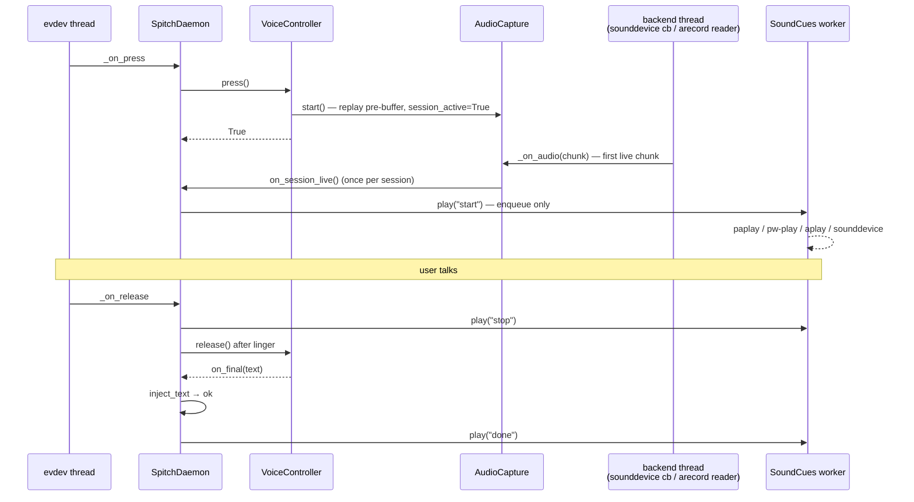

# Sound cues: tick when the mic is live

| Field | Value |
|-------|-------|
| **Date** | 2026-09-02 |
| **Status** | Implemented |
| **Background** | [`beep.md`](beep.md) — product survey and the UX argument |
| **Code** | `src/spitch/sounds.py`, `src/spitch/voice/audio.py` (`on_session_live`), `src/spitch/daemon.py` (`_on_capture_live`, release / cancel / inject hooks) |
| **Tests** | `tests/test_sounds.py`, `tests/test_daemon_sound_cues.py`, `tests/test_audio_prebuffer.py::SessionLiveTests` |

## 中文摘要

- **结论**：三种提示音已实现并默认开启——`start`（麦克风就绪 tick）、`stop`（松手 tok）、`done`（粘贴完成 ding）。总开关 / 音量 / 单项开关 / 自定义 WAV 见 §5。
- **核心不变量（§2）**：`start` 只在**本次 session 的第一块 live PCM 进入 session 队列之后**才响，触发点是 `AudioCapture.on_session_live`，不是热键回调。听到 tick 再说，不会丢；按下没声音就是这次没在录（上一次还在 FINALIZING、麦克风挂了、正在 reload）。
- **为什么 Spitch 之前会"丢开头"（§1）**：麦克风常驻 + 500 ms prebuffer 之后，音频本身没丢；丢的是用户的判断——不知道按键是否被接受，说早了或按晚了。提示音补的是这一层反馈。
- **时延（§4）**：真实 session 按下 → mic live 10 ms / 34 ms（麦克风常驻，等的是下一个 100 ms chunk 边界，0–100 ms 均匀分布）；紧凑循环基准 106 ms。`paplay --latency-msec=30` 播放 90 ms 的 tick 整段 112 ms wall。用户听到 tick 大约在按下后 50–200 ms。prebuffer 覆盖这段时间，所以这个延迟不影响正确性，只影响手感。
- **取舍（§6）**：外放时提示音会被麦克风录进去（开头 90 ms、松手后 linger 内 70 ms）。2026-09-02 两次 Doubao 真实 session 转写干净，首尾没有多余 token；Grok 未测。`done` 只在粘贴成功后响，没响就是没粘上。
- **验证（§7）**：`PYTHONPATH=src python3 -m unittest discover -s tests` 344 通过；2026-09-02 14:53 操作者实际按住 RightCtrl 两次，三声都听到，daemon.log 有 `mic live` 与 `inject: result ok=True`。

## 1. Problem

Dictation is eyes-off. The user is looking at another monitor, at the
document, or nowhere, and the tray label is not where their attention
is. What they need is a signal that arrives on the channel they are
already using — sound — and that means one specific thing: *the
microphone is capturing right now, talk.*

Spitch already keeps the mic open and replays a 500 ms pre-buffer on
every press (`audio.prebuffer_ms`), so the head of an utterance is not
lost to mic start-up. What still goes wrong is the user's model of the
machine:

- A press during the previous session's FINALIZING is rejected
  (`press: voice not idle`). The user talks into nothing.
- A press during a config reload is ignored. Same.
- The audio backend can be suspended by PipeWire after idle; the
  recycle path takes up to a few hundred ms with an empty pre-buffer.
- Without any cue the user hedges: waits an unknown beat, or starts
  early and hopes the pre-buffer covers it.

`beep.md` surveys how Wispr Flow and VoiceInk handle this and lands on
the requirement that matters: the start sound must mean *capture is
running*, never *hotkey received*. VoiceInk shipped the wrong order
(sound first, capture ~1 s later) and users lost their first words to
the very cue meant to prevent that.

## 2. Invariant

```text
START cue plays  ⇔  the first live PCM chunk of this session has been
                    pushed into the session queue.
```

Where "live" means delivered by the backend *after* `AudioCapture.start()`
— the pre-buffer replay does not count, it is audio from before the
press. Consequences the user can rely on:

- Hear the tick → everything said from now on is in the stream (and
  the 500 ms before the press, from the pre-buffer).
- Hear nothing after pressing → nothing is being recorded. Wait for
  the previous session to finish, or look at the tray.
- The cue cannot fire for a rejected press, a dead mic, or a session
  whose backend never delivers a chunk. That silence is the signal.

## 3. Wiring



- `AudioCapture(on_session_live=…)` fires from the backend thread, once
  per `start()`, guarded by `_session_live` under the existing lock.
  Exceptions in the callback are swallowed; feedback never hurts
  capture.
- `SpitchDaemon._on_capture_live` logs `mic live: first chunk N ms
  after press` and calls `SoundCues.play("start")`. It does not read
  `_active_source` — the chunk can land before `_on_press` has tagged
  the session, and both paste and salmon sessions want the cue.
- `stop` is played at key-up (paste and salmon), on chord cancel of an
  accepted press, and when the salmon watchdog forces a release. It is
  enqueued before `MediaPauser.resume()` so a slow `playerctl` round
  trip cannot delay it.
- `done` is played in `_finalize_and_inject` only when `inject_text`
  returned ok. Empty transcript, final-wait timeout, and inject failure
  stay silent after `stop`, so "no ding" reliably means "nothing landed"
  and the user can repaste or redo without looking.
- `SoundCues.play()` only enqueues a name; one daemon worker thread
  plays. Safe to call from the PortAudio callback. A wedged backend
  cannot grow an unbounded backlog of stale beeps (soft cap of 8).
- `reload_config` rebuilds `SoundCues` from the new config and closes
  the old one; `_shutdown` closes it.

## 4. Latency budget (measured 2026-09-02, this workstation)

| Stage | Measured | Notes |
|---|---|---|
| press → first live chunk, live daemon | 10 ms and 34 ms (two real sessions) | The mic stream is already running, so the wait is "until the next 100 ms chunk boundary": uniform 0–100 ms. |
| press → first live chunk, tight loop benchmark | 106 ms median, 106 ms max (8 runs) | `arecord` backend; `start()` right after `stop()` always lands at the start of a chunk. Bounded by `chunk_ms = 100`; sounddevice has the same blocksize. |
| `paplay` start cue, whole process | 219 ms → **112 ms** with `--latency-msec=30` | 90 ms clip; overhead ≈ 22 ms with the flag |
| `pw-play` start cue | 176 ms → 134 ms with `--latency=30ms` | |
| `aplay` start cue | 219 ms | no latency flag |

So the user hears the tick roughly 50–200 ms after key-down on the
CLI path. The pre-buffer covers the whole window, so this delay affects
feel, not correctness. To cut it further: install `python3-sounddevice`
(in-process PortAudio output, no fork), or lower `chunk_ms` in
`AudioConfig` (not exposed in config; it changes the capture pipeline
for both providers).

## 5. Configuration

`config.json`, section `sounds`:

| Key | Default | Meaning |
|---|---|---|
| `enabled` | `true` | Master switch |
| `volume` | `0.3` | Linear gain 0–1 on the built-in tones (authored at full scale) or on a custom file. `0` disables. Non-finite → default, out of range → clamped. |
| `start` / `stop` / `done` | `true` | Per-cue switches |
| `start_file` / `stop_file` / `done_file` | `""` | 16-bit PCM WAV, mono or stereo, ≤ 10 s. Empty → built-in tone. Unreadable or unsupported → built-in tone plus a warning in `daemon.log`. |

The console Settings tab exposes `enabled` and `volume`; save
hot-reloads. A non-mapping `sounds` section (hand-edited JSON) means
defaults, per the KD-22 rule used elsewhere.

Built-in tones (48 kHz mono, rendered at start-up):

| Cue | Shape | Length |
|---|---|---|
| `start` | 1320 Hz sine, 3 ms attack, 35 ms decay | 90 ms |
| `stop` | 880 Hz, softer (×0.8), 25 ms decay | 70 ms |
| `done` | 1047 Hz then 1568 Hz, softer (×0.7) | 135 ms |

Every clip fades linearly over its last 4 ms so it never ends
mid-cycle; `tests/test_sounds.py` asserts both edges are at zero.

## 6. Backends and trade-offs

Backends are tried in order and a failing one is dropped after one
warning: `sounddevice` (optional module; `ImportError` is silent),
`paplay`, `pw-play`, `aplay`. CLI players read a WAV that
`sounds.py` writes atomically to `$XDG_CACHE_HOME/spitch/cues/`
(`~/.cache/spitch/cues/`), rewritten only when the clip changes. With
no working backend the cues are disabled with a single warning; voice
input is unaffected.

Echo into the mic: on speakers, the start tick lands in the first
~100 ms of the stream and the stop tone in the 300 ms release linger.
Both are short pure tones at about −10 dBFS at the default volume.
Two live Doubao sessions on 2026-09-02 (default volume, this
workstation's speakers and mic) produced clean transcripts with no
stray token at the head or tail. Grok is untested. Headphones remove
the question. If a provider ever transcribes the tone, lower `volume`
or disable `stop` first — `start` is the one that matters.

`pause_media_on_talk` and the cues are independent: `playerctl`
pauses MPRIS players, the cue is a plain PulseAudio/PipeWire client.

## 7. Verification

```bash
PYTHONPATH=src python3 -m unittest discover -s tests        # 344 tests, OK
PYTHONPATH=src python3 -m unittest tests.test_sounds tests.test_daemon_sound_cues -v
tail -f ~/.local/state/spitch/daemon.log                     # per press:
#   press: session started (...)
#   mic live: first chunk 106 ms after press
```

Manual check after `systemctl --user restart spitch.service`: hold
`RightCtrl`, wait for the tick, talk, release — tok; text lands —
ding. Press again immediately after releasing: no tick until the
previous session is idle, then the next press ticks.

Done 2026-09-02 14:53 by the operator on this workstation: two
sessions, all three cues heard, `daemon.log` shows `mic live` at
10 ms and 34 ms after press and `inject: result ok=True` for both.
